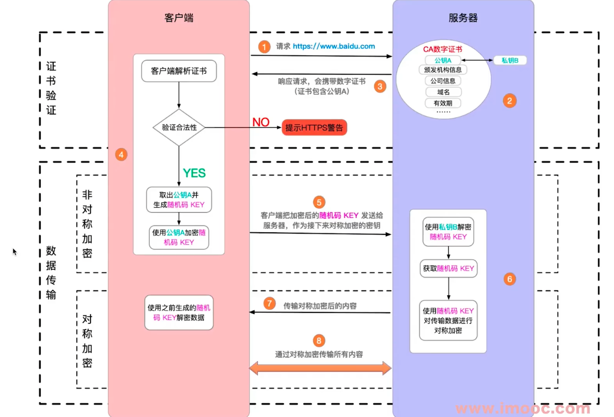

# https

## http和https

- http是明文传输，铭感信息容易被中间劫持
- https = http + 加密，劫持了也无法加密
- 现代浏览器已开始强制https协议

## 加密方式：对称加密，非对称加密

- 对称加密：一个key同时负责加密、解密
- 非对称加密：一个key，A加密之后，只能用B来解密

## https证书

- 中间人攻击
- 使用第三方证书（慎用免费、不合规的证书）
- 浏览器校验证书

